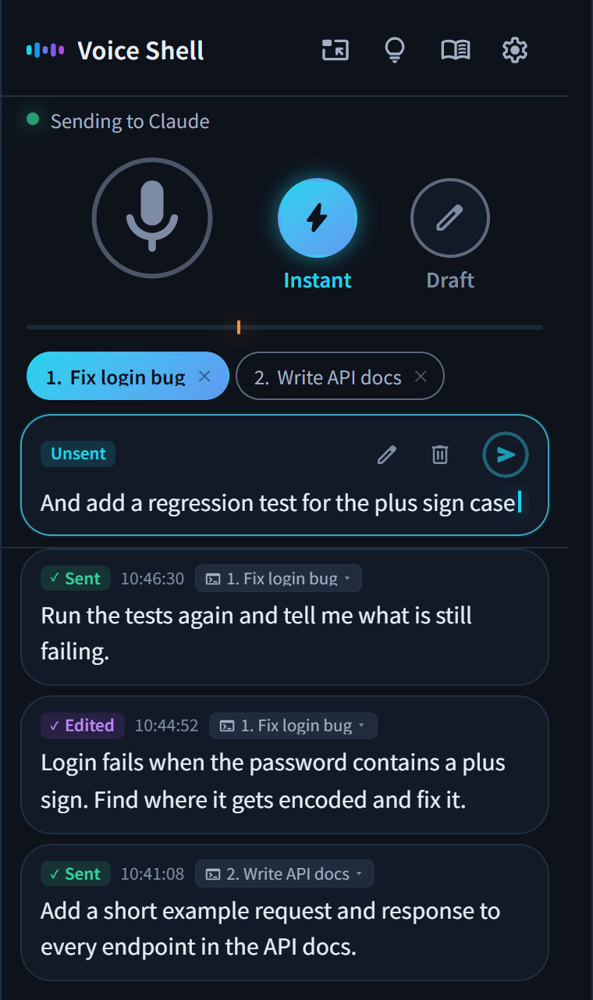

<p align="center">
  
</p>

<h1 align="center">Voice Shell</h1>

<p align="center">
  English · <a href="docs/readme/README.ja.md">日本語</a> · <a href="docs/readme/README.es.md">Español</a> · <a href="docs/readme/README.fr.md">Français</a> · <a href="docs/readme/README.de.md">Deutsch</a> · <a href="docs/readme/README.zh.md">简体中文</a> · <a href="docs/readme/README.zh-TW.md">繁體中文</a> · <a href="docs/readme/README.ko.md">한국어</a>
</p>

<p align="center">
  
  
</p>

<h3 align="center">Just speak your mind, and Claude Code gets to work!</h3>

<p align="center">Voice Shell is an Agent Skill for talking to Claude Code instead of typing.</p>

<p align="center">
  
</p>

## 💡 Features

### 1. Hands-free control of Claude Code

No need to press Enter or click send. Three seconds after you finish speaking, your prompt is sent automatically.\
You can also mute, cancel, and switch sessions by voice.

### 2. A dictionary for the words you use

Teach it once, and "cloud code" becomes "Claude Code" from then on.\
Your name, your company, the tools you work with, all easy to add.

### 3. Completely free, and private if you want it to be

High-quality speech recognition at no cost, with nothing to subscribe to.\
On a laptop, it uses the browser's built-in recognition. On a Mac or a capable PC, it can run entirely locally.

## 📦 Setup

### Requirements

- Claude Code
- Python 3
- Node.js
- Google Chrome

### Install

Paste this into your terminal.

```bash
pip install numpy aiohttp "sounddevice>=0.5.6"
npx skills add ykuwai/voice-shell -g -a claude-code -y
```

Then type `/voice-shell` in Claude Code. It checks for anything missing and sets itself up.

### Update

New features land often, so update every now and then.

```bash
npx skills update voice-shell -y
```

## 🎙️ Choosing a recognizer

Voice Shell supports three speech recognizers. Pick the one that fits your hardware.\
Switch between them in the on-screen settings. If one needs setup, just ask Claude Code.

### 1. Laptops — Browser speech recognition

Nothing to set up. It just works.\
It uses Chrome's free, built-in speech recognition (Web Speech API).\
Where it recognizes is Chrome's call. With a model for your language on the machine it may recognize there, and without one your audio goes to Google's servers.

### 2. Macs — Apple's on-device recognition

If you'd rather your audio never left your computer, use a recognizer that runs locally.\
On macOS 26 or later, Apple's own recognition is fast and easy on the battery.\
The first run downloads a speech model, so it takes a little while.

### 3. Powerful PCs (Windows / Linux) — Faster Whisper

With an NVIDIA GPU on Windows or Linux, [Faster Whisper](https://github.com/SYSTRAN/faster-whisper) runs everything locally.\
The first run sets up its environment and downloads a model, so it takes a little while.

## 🚀 Usage

Run `/voice-shell` in Claude Code and voice mode starts.\
Just say what's on your mind, and the work keeps moving.\
Your settings are saved, so next time it picks up right where you left off.

### 1. Type `/voice-shell` in Claude Code

The Voice Shell window opens in Chrome.\
Click "Keep this window on top" to keep it in front of everything else.

### 2. Unmute and start talking

What you say is sent to Claude Code.\
Anything very short (about three words or fewer) is treated as background noise and isn't sent. You can change the minimum length in the settings.\
Say "mute" whenever you want the microphone off.

### 3. Changed your mind? End with "cancel that"

Finish with "cancel that", and what you just said is thrown away instead of sent.\
For a quick fix before sending, click the text on screen and edit it.

### 4. Use it across multiple sessions

Run `/voice-shell` in several Claude Code sessions, and each one shows up as a numbered button at the top of the window.\
Click one, or say "number two" or "session 2", to choose where your words go.

> [!NOTE]
> **Ending voice mode**
>
> Tell Claude Code "stop voice mode", or type `/voice-shell stop`.

## 📨 Send modes

The buttons next to the microphone switch between two send modes.

- **Instant mode** (the default) — Everything you say is sent right away.
- **Draft mode** — What you say builds up on screen. Touch it up with the keyboard if you need to, and send it when you're ready.

To draft just the last thing you said, end it with "edit this". Voice Shell switches to Draft mode just for that, so you can fix it before it goes out.

## 🗣️ Voice commands

| Voice command | Action |
|---|---|
| "mute" | Turns the microphone off |
| "unmute" | Turns the microphone back on. Heard by the local recognizers, and by browser recognition when it runs on this device.<br>With plain browser recognition, click the on-screen microphone instead |
| "number two", "session 2" | Switches to that session when you have more than one |
| "cancel that" at the end | Discards what you just said |
| "edit this" at the end | Switches to Draft mode just for that |
| "draft", "instant" | Switches the send mode |

> [!TIP]
> Click the lightbulb icon on screen for the full list.\
> You can add your own phrases there, or turn off the ones you never use.

### Using more than one computer

If two computers are listening at the same time, saying "mute" mutes both.\
Open the lightbulb icon, turn on "Several machines" below the list of commands and give each computer a name, like "work" or "home". Then "work mute" mutes only that one.

## ✨ Handy features and settings

### 1. Adjust the send delay

By default, a message is sent three seconds after you finish speaking. If you like to pause and think, stretch it to 5 or 10 seconds.\
The marker under the microphone sets how quiet counts as "done talking." In a noisy room, raise it a little.

### 2. Stray chatter goes on hold

Forgot to mute, and a few unrelated remarks slipped through? Claude Code notices, switches to Draft mode, and holds them for you.\
Everything you said stays on screen, so nothing is lost.

### 3. Fix the destination afterward

Sent something to the wrong session? Just pick the right one with the mouse.

### 4. Drag to add to the dictionary

When a word comes out wrong, drag over it to add it to the dictionary.\
It'll be recognized correctly from then on.

## ⌨️ Keyboard shortcuts

| Key | Action |
|---|---|
| `Shift` + `M` | Turns the microphone on or off |
| `Shift` + `L` | Switches to Instant mode |
| `Shift` + `H` | Switches to Draft mode |
| `Shift` + `E` | Switches to Draft mode just for the last thing you said |
| `Shift` + `1` to `9` | Picks a session by number |
| `Shift` + `Backspace` | Discards anything not yet sent |
| `Ctrl` + `Enter` (`Cmd` + `Enter` on a Mac) | Sends the draft |
| `,` | Opens the settings |
| `.` | Opens the dictionary |
| `?` | Shows every shortcut and voice command |

## 📖 For AI agents

These are the documents Claude Code and other AI agents read when running Voice Shell.

- [SKILL.md](skills/voice-shell/SKILL.md) explains how to use it and how it behaves
- [SETUP.md](skills/voice-shell/SETUP.md) covers setup for each environment, plus troubleshooting

## 📄 License

MIT
