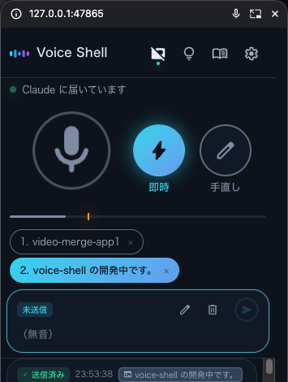

# Voice Shell

English · [日本語](docs/readme/README.ja.md) · [Español](docs/readme/README.es.md) · [Français](docs/readme/README.fr.md) · [Deutsch](docs/readme/README.de.md) · [简体中文](docs/readme/README.zh.md) · [한국어](docs/readme/README.ko.md)

<p align="center">
  
  
</p>

**Talk to Claude Code. No keyboard.**

You think out loud while you work, and the sentence lands as a prompt, no
Enter key involved. Not dictation bolted onto a text box: mute, review, undo,
and pick which session hears you, all by voice, while your hands stay on
whatever you were doing.

<p align="center">
  
</p>

## Why

- **Nothing to press to send it.** Most voice tools fill a text box and wait
  for you to hit send. Here the sentence goes straight through the moment
  it's heard, no button, no confirmation step, no window to click into.
- **Nothing to install to try it.** The default recognizer is your browser.
  No model download, no wait. When you want it fully private, switch to
  on-device recognition (Apple, or Whisper) with one setting, no re-learning
  anything.
- **A full voice UI, not a microphone icon.** "Mute", "hold", "live",
  "cancel that", "session 2" — said at the end of a sentence, all of it works
  hands-free. The floating window shows exactly what it heard as you say it.
- **Run it for more than one thing at once.** Keep voice mode on in several
  Claude Code sessions and choose which one gets your words, from the window
  or by voice.
- **Misheard names fix themselves.** Teach it once ("cloud code → Claude
  Code") and the correction applies from then on, even to text still being
  recognized.

## Install

```bash
npx skills add ykuwai/voice-shell
pip install numpy aiohttp "sounddevice>=0.5.6"
```

If you have Chrome, that is all it takes.

Type `/voice-shell` in Claude Code, or say "voice mode", to start. The steps
an agent follows from there are in [SKILL.md](skills/voice-shell/SKILL.md).

Running that from an agent, or from a script, name Claude Code instead of
leaving it to detect on its own, and add `-y` to skip the confirmation.

```bash
npx skills add ykuwai/voice-shell -a claude-code -y
```

## Update

```bash
npx skills update voice-shell -y
```

Leave off `-y` and it asks first. Drop the name and it updates every skill
you have installed, this one included.

## Where your voice goes

> [!NOTE]
> The default is browser recognition, so the audio is sent to Google's servers.
> When you want it to stay on your machine, pick another way from the settings
> in the window. The same warning is written there on the spot.

| Way | What it needs | Where the audio goes |
|---|---|---|
| **This browser** (default) | Chrome. Works only while the window is open | **Google's servers** |
| Apple on-device | macOS 26 or later. Nothing extra to install | Stays on the machine |
| Whisper | `faster-whisper`. Strong on proper nouns | Stays on the machine |

It remembers the way you picked, so next time it starts the same way. The two ways
that keep everything local are in [SETUP.md](skills/voice-shell/SETUP.md).

Which languages it can recognize is decided by the way you picked. The browser
offers what Chrome carries, Apple offers the locales installed in the OS, Whisper
offers what the model covers. The window itself comes in seven languages.

## Commands

```bash
voice-shell.sh start [--engine X] [--no-gui]
voice-shell.sh stop
voice-shell.sh status
voice-shell.sh engines
```

| Command | What it does |
|---|---|
| `start` | Starts it, and remembers the way you picked last time |
| `stop` | Stops it |
| `status` | What is running, and which session is listening |
| `engines` | The ways it can recognize speech |

Everything you set stays in `~/.config/voice-shell/` and survives a restart.

## A little more

The two below are in English only. What most people need is already above.

| What to read | What is in it |
|---|---|
| [SETUP.md](skills/voice-shell/SETUP.md) | How to install it per environment, and what to do when you get stuck |
| [SKILL.md](skills/voice-shell/SKILL.md) | The steps the agent reads. The fine behavior is here |

## References

- [Web Speech API (MDN)](https://developer.mozilla.org/docs/Web/API/SpeechRecognition)
- [faster-whisper](https://github.com/SYSTRAN/faster-whisper)

## License

MIT

This file is the source. The six translations beside it are made from it, so when
you change something here, change them too in the same pull request. Where a
translation and this file disagree, this file is right.
