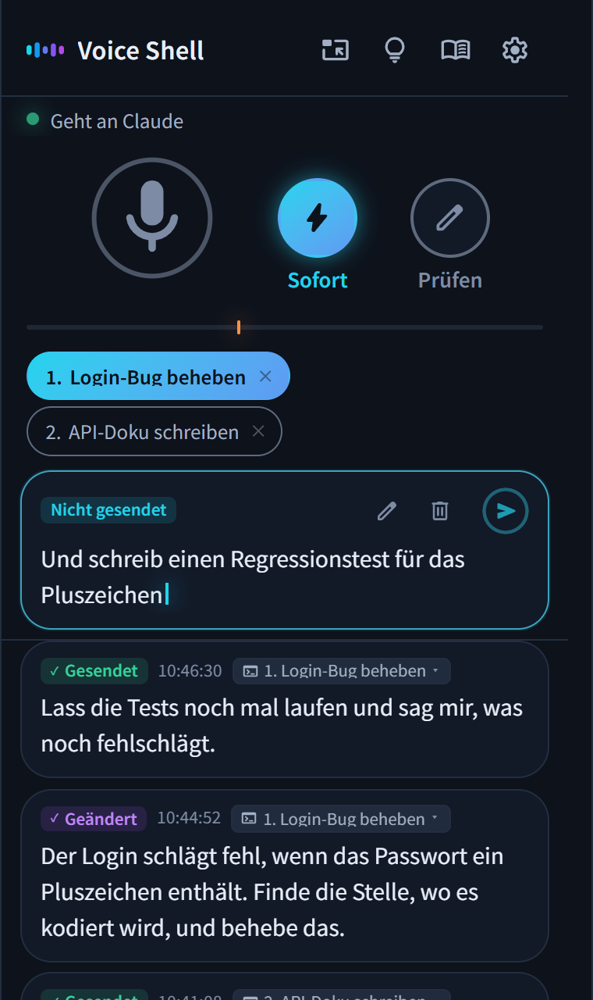

<p align="center">
  
</p>

<h1 align="center">Voice Shell</h1>

<p align="center">
  <a href="../../README.md">English</a> · <a href="README.ja.md">日本語</a> · <a href="README.es.md">Español</a> · <a href="README.fr.md">Français</a> · Deutsch · <a href="README.zh.md">简体中文</a> · <a href="README.zh-TW.md">繁體中文</a> · <a href="README.ko.md">한국어</a>
</p>

<p align="center">
  
  
</p>

<h3 align="center">Sag einfach, was du willst, und Claude Code legt los!</h3>

<p align="center">Voice Shell ist ein Agent Skill, mit dem du Claude Code per Stimme steuerst, statt zu tippen.</p>

<p align="center">
  
</p>

## 💡 Funktionen

### 1. Claude Code nur mit der Stimme steuern

Kein Enter, kein Senden-Knopf. Drei Sekunden nachdem du aufgehört hast zu sprechen, geht dein Prompt automatisch an Claude Code.\
Stummschalten, Verwerfen und den Wechsel der Sitzung erledigst du ebenfalls per Stimme.

### 2. Ein Wörterbuch für deine Begriffe

Häufig falsch erkannte Wörter werden automatisch korrigiert, etwa „cloud code“ zu „Claude Code“.\
Namen von Personen, Firmen oder Diensten trägst du mit wenigen Klicks ein.

### 3. Komplett kostenlos und sicher

Gute Spracherkennung ohne Kosten und ohne Abo.\
Auf dem Laptop nutzt du die Spracherkennung des Browsers. Auf einem Mac oder einem leistungsstarken PC kann alles lokal laufen.

## 📦 Einrichtung

### Voraussetzungen

- Claude Code
- Python 3
- Node.js
- Google Chrome

### Installation

Füge diese Befehle in dein Terminal ein und führe sie aus.

```bash
pip install numpy aiohttp "sounddevice>=0.5.6"
npx skills add ykuwai/voice-shell -g -a claude-code -y
```

Danach tippst du in Claude Code `/voice-shell`. Es prüft, was noch fehlt, und startet von selbst.

### Aktualisieren

Neue Funktionen kommen laufend dazu. Aktualisiere deshalb ab und zu mit diesem Befehl.

```bash
npx skills update voice-shell -y
```

## 🎙️ Die passende Spracherkennung

Es gibt drei Arten der Spracherkennung. Wähle die, die zu deinem Rechner passt.\
Umschalten kannst du in den Einstellungen im Fenster. Wenn eine Einrichtung nötig ist, sag es einfach Claude Code.

### 1. Laptops — Spracherkennung im Browser

Keine Einrichtung nötig, funktioniert sofort.\
Sie nutzt die kostenlose Spracherkennung, die in Chrome eingebaut ist (Web Speech API).\
Dein Audio wird auf den Servern von Google verarbeitet.

### 2. Macs — Apple Erkennung auf dem Gerät

Wenn dein Audio den Rechner nicht verlassen soll, nimm eine Erkennung, die lokal läuft.\
Auf einem Mac mit macOS 26 oder neuer steht die Spracherkennung von Apple bereit. Sie ist schnell und braucht wenig Strom.\
Beim ersten Start wird ein Sprachmodell heruntergeladen, das dauert einen Moment.

### 3. Leistungsstarke PCs (Windows / Linux) — Faster Whisper

Mit einer NVIDIA-GPU unter Windows oder Linux läuft mit [Faster Whisper](https://github.com/SYSTRAN/faster-whisper) alles lokal.\
Beim ersten Start wird die Umgebung eingerichtet und ein Modell heruntergeladen, das dauert einen Moment.

## 🚀 Verwendung

Starte `/voice-shell` in Claude Code, und der Sprachmodus beginnt.\
Sprich einfach aus, was dir durch den Kopf geht, und die Arbeit läuft weiter.\
Deine Einstellungen werden gespeichert, beim nächsten Mal geht es also genau dort weiter, wo du aufgehört hast.

### 1. `/voice-shell` in Claude Code eingeben

Das Voice-Shell-Fenster öffnet sich in Chrome.\
Mit „Dieses Fenster oben halten“ bleibt es immer im Vordergrund.

### 2. Stummschaltung aufheben und lossprechen

Was du sagst, geht direkt an Claude Code.\
Sehr kurze Ergebnisse (etwa drei Wörter oder weniger, wie „ja“ oder „okay“) gelten als Geräusch und werden nicht gesendet. Die Mindestlänge kannst du in den Einstellungen ändern.\
Sag „Stumm“, wenn das Mikrofon aus sein soll.

### 3. Doch nicht senden? Zum Schluss „streich das“

Sagst du am Ende „streich das“, wird das eben Gesagte verworfen statt gesendet.\
Willst du vor dem Senden noch etwas korrigieren, klick auf den Text im Fenster und bearbeite ihn mit der Tastatur.

### 4. Mit mehreren Sitzungen nutzen

Startest du `/voice-shell` in mehreren Claude-Code-Sitzungen, erscheinen sie nummeriert oben im Fenster.\
Klick auf eine oder sag „Nummer zwei“ oder „Sitzung 2“, um das Ziel zu wechseln.

> [!NOTE]
> **Sprachmodus beenden**
>
> Sag Claude Code „Beende den Sprachmodus“ oder tippe `/voice-shell stop`.

## 📨 Sendemodi

Mit den Knöpfen neben dem Mikrofon wechselst du den Sendemodus.

- **Sofort** (Standard) → Was du sagst, geht direkt raus.
- **Prüfen** → Was du sagst, sammelt sich im Fenster. Du kannst es bei Bedarf mit der Tastatur korrigieren und sendest, wann du willst.

Willst du nur das eben Gesagte korrigieren, sag am Ende „das ändere ich“. Dann gilt nur dafür vorübergehend der Modus Prüfen, und du kannst es vor dem Senden anpassen.

## 🗣️ Sprachbefehle

| Sprachbefehl | Aktion |
|---|---|
| „Stumm“, „Mikro aus“ | Schaltet das Mikrofon aus |
| „Stummschaltung aufheben“, „Mikrofon an“ | Schaltet das Mikrofon wieder ein. Die lokale Erkennung hört es, und die Browser-Erkennung auch, wenn sie auf diesem Gerät läuft.<br>Bei der gewöhnlichen Browser-Erkennung klickst du stattdessen auf das Mikrofon im Fenster |
| „Nummer zwei“, „Sitzung 2“ | Wechselt zu dieser Sitzung, wenn mehrere laufen |
| „streich das“ am Ende | Verwirft das eben Gesagte |
| „das ändere ich“ am Ende | Wechselt nur dafür vorübergehend in den Modus Prüfen |
| „Entwurfsmodus“, „Sofortmodus“ | Wechselt den Sendemodus |

> [!TIP]
> Die vollständige Liste findest du hinter dem Glühbirnen-Symbol im Fenster.\
> Dort kannst du auch eigene Formulierungen hinzufügen oder Befehle abschalten, die du nicht brauchst.

### Mehrere Rechner

Hören zwei Rechner gleichzeitig zu, schaltet „Stumm“ beide stumm.\
Öffne das Glühbirnen-Symbol, aktiviere unter der Befehlsliste „Mehrere Rechner“ und gib jedem Rechner einen Namen, etwa „Arbeit“ oder „Privat“. Dann schaltet „Arbeit stumm“ nur diesen einen stumm.

## ✨ Praktische Funktionen und Einstellungen

### 1. Wann gesendet wird, stellst du selbst ein

Standardmäßig wird drei Sekunden nach dem Ende deines Satzes gesendet. Wenn du gern Pausen machst, stell 5 oder 10 Sekunden ein.\
Ab welcher Lautstärke du als fertig giltst, stellst du mit der Marke unter dem Mikrofon ein. Bei viel Umgebungslärm schieb sie etwas höher.

### 2. Nebengespräche werden automatisch zurückgehalten

Vergessen stummzuschalten, und ein paar Sätze ohne Bezug sind durchgerutscht? Claude Code merkt das, wechselt in den Modus Prüfen und hält sie zurück.\
Alles Gesagte bleibt im Fenster stehen, es geht also nichts verloren.

### 3. Das Ziel nachträglich ändern

An die falsche Sitzung gesendet? Wähl mit der Maus einfach die richtige aus.

### 4. Per Ziehen ins Wörterbuch

Wird ein Wort falsch erkannt, markiere es durch Ziehen und füge es so dem Wörterbuch hinzu.\
Ab dann wird es richtig erkannt.

## ⌨️ Tastenkürzel

| Taste | Aktion |
|---|---|
| `Shift` + `M` | Schaltet das Mikrofon ein oder aus |
| `Shift` + `L` | Wechselt in den Modus Sofort |
| `Shift` + `H` | Wechselt in den Modus Prüfen |
| `Shift` + `E` | Wechselt nur für das eben Gesagte in den Modus Prüfen |
| `Shift` + `1` bis `9` | Wählt eine Sitzung per Nummer |
| `Shift` + `Backspace` | Verwirft alles, was noch nicht gesendet ist |
| `Ctrl` + `Enter` (auf dem Mac `Cmd` + `Enter`) | Sendet den bearbeiteten Text |
| `,` | Öffnet die Einstellungen |
| `.` | Öffnet das Wörterbuch |
| `?` | Zeigt alle Tastenkürzel und Sprachbefehle |

## 📖 Für KI-Agenten

Diese Dokumente lesen Claude Code und andere KI-Agenten, wenn sie Voice Shell ausführen.

- [SKILL.md](../../skills/voice-shell/SKILL.md) beschreibt die Bedienung und das Verhalten
- [SETUP.md](../../skills/voice-shell/SETUP.md) erklärt die Einrichtung je nach Umgebung und hilft bei Problemen

## 📄 Lizenz

MIT
