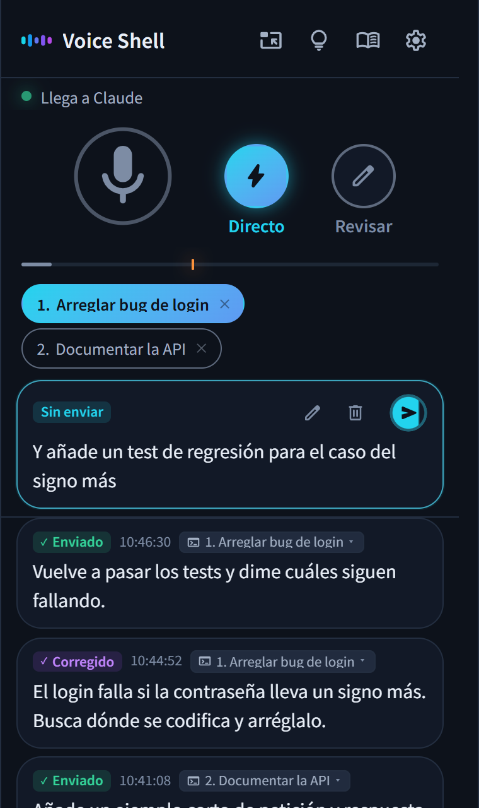

<p align="center">
  
</p>

<h1 align="center">Voice Shell</h1>

<p align="center">
  <a href="../../README.md">English</a> · <a href="README.ja.md">日本語</a> · Español · <a href="README.fr.md">Français</a> · <a href="README.de.md">Deutsch</a> · <a href="README.zh.md">简体中文</a> · <a href="README.zh-TW.md">繁體中文</a> · <a href="README.ko.md">한국어</a>
</p>

<p align="center">
  
  
</p>

<h3 align="center">¡Di lo que quieres hacer y Claude Code se pone a trabajar!</h3>

<p align="center">Voice Shell es una Agent Skill para darle instrucciones a Claude Code con la voz.</p>

<p align="center">
  
</p>

## 💡 Características

### 1. Controla Claude Code solo con la voz

No hace falta ningún botón de enviar. Tres segundos después de que terminas de hablar, el mensaje llega solo a Claude Code.\
También puedes silenciar, cancelar y cambiar de sesión con la voz.

### 2. Un diccionario para tus palabras

Corrige solo las palabras que se reconocen mal, por ejemplo «cloud code» se convierte en «Claude Code».\
Añadir nombres de personas, empresas o servicios es muy fácil.

### 3. Totalmente gratis y seguro

Reconocimiento de voz de alta calidad sin coste. No hay nada que pagar.\
En un portátil usa el reconocimiento del navegador. En un Mac o en un PC potente, todo puede procesarse en local.

## 📦 Instalación

### Requisitos

- Claude Code
- Python 3
- Node.js
- Google Chrome

### Instalar

Pega estos comandos en la terminal y ejecútalos.

```bash
pip install numpy aiohttp "sounddevice>=0.5.6"
npx skills add ykuwai/voice-shell -g -a claude-code -y
```

Después escribe `/voice-shell` en Claude Code. Comprueba lo que falta y lo deja todo listo por sí solo.

### Actualizar

Se añaden funciones con frecuencia, así que actualiza de vez en cuando.

```bash
npx skills update voice-shell -y
```

## 🎙️ Cómo elegir el reconocimiento de voz

Hay tres formas de reconocer la voz. Elige la que mejor se adapte a tu equipo.\
Se cambia desde los ajustes de la ventana. Si alguna necesita instalación, pídeselo a Claude Code y se encarga.

### 1. Portátiles - Reconocimiento del navegador

No hay que instalar nada. Funciona desde el primer momento.\
Es el reconocimiento de voz gratuito que trae Chrome (Web Speech API).\
Mientras Chrome tenga el modelo de tu idioma, se reconoce en el equipo. Sin él, el audio va a los servidores de Google. Los ajustes dicen cuál de las dos cosas está pasando.

### 2. Mac - Reconocimiento local de Apple

Si prefieres que tu voz no salga del equipo, usa un reconocimiento que funcione en local.\
En un Mac con macOS 26 o posterior puedes usar el reconocimiento de Apple. Es rápido y gasta poca batería.\
La primera vez descarga un modelo de voz, así que tarda un poco.

### 3. PC potentes (Windows / Linux) - Faster Whisper

Con una GPU NVIDIA en Windows o Linux, [Faster Whisper](https://github.com/SYSTRAN/faster-whisper) lo procesa todo en local.\
La primera vez prepara el entorno y descarga un modelo, así que tarda un poco.

## 🚀 Uso diario

Ejecuta `/voice-shell` en Claude Code y empieza el modo voz.\
Solo tienes que decir en voz alta lo que tienes en mente, y el trabajo avanza.\
Los ajustes se guardan, así que la próxima vez lo tienes todo como lo dejaste.

### 1. Escribe `/voice-shell` en Claude Code

Se abre la ventana de Voice Shell en Chrome.\
Haz clic en «Mantener esta ventana encima» para tenerla siempre delante de las demás.

### 2. Activa el micrófono y habla

Lo que dices llega tal cual a Claude Code.\
Lo muy corto (unas tres palabras o menos) se toma como ruido y no se envía. La longitud mínima se cambia en los ajustes.\
Cuando quieras dejar de hablar, di «silenciar» y el micrófono se apaga.

### 3. ¿Te arrepientes? Termina con «cancela eso»

Si terminas con «cancela eso», lo que acabas de decir se descarta y no se envía.\
Para retocarlo antes de enviarlo, haz clic en el texto de la ventana y corrígelo con el teclado.

### 4. Úsalo desde varias sesiones

Si ejecutas `/voice-shell` en varias sesiones de Claude Code, aparecen numeradas en la parte superior de la ventana.\
Haz clic en una o di «sesión 2» o «número dos» para cambiar el destino.

> [!NOTE]
> **Cómo salir del modo voz**
>
> Dile a Claude Code «termina el modo voz» o escribe `/voice-shell stop`.

## 📨 Modos de envío

Los botones junto al micrófono cambian el modo de envío.

- **Directo** (el habitual) → Lo que dices se envía al momento.
- **Revisar** → Lo que dices se acumula en la ventana. Puedes retocarlo con el teclado si hace falta y enviarlo cuando quieras.

Para corregir solo lo último que has dicho, termina con «lo edito yo». Pasa al modo Revisar solo para esa frase y puedes corregirla antes de enviarla.

## 🗣️ Comandos de voz útiles

| Comando de voz | Acción |
|---|---|
| «silenciar» | Apaga el micrófono |
| «quitar silencio» | Enciende el micrófono. Lo oyen el reconocimiento local y el del navegador cuando funciona en este equipo.<br>Con el reconocimiento normal del navegador, pulsa el micrófono de la ventana |
| «sesión 2», «número dos» | Cambia el destino a esa sesión cuando usas varias |
| «cancela eso» al final | Descarta lo que acabas de decir |
| «lo edito yo», «déjame editarlo» al final | Pasa al modo Revisar solo para esa frase |
| «revisar», «directo» | Cambia el modo de envío |

> [!TIP]
> Todos los comandos de voz están en el icono de la bombilla de la ventana.\
> Ahí también puedes añadir los tuyos o desactivar los que no uses.

### Varias máquinas

Si usas dos ordenadores a la vez, decir «silenciar» silencia los dos.\
Abre el icono de la bombilla, activa «Varias máquinas» debajo de la lista de comandos y ponle a cada uno un nombre, como «trabajo» o «casa». Así «trabajo silenciar» silencia solo ese.

## ✨ Funciones y ajustes útiles

### 1. Ajusta cuándo se envía

Por defecto, el mensaje se envía tres segundos después de que terminas de hablar. Si hablas despacio y con pausas, puedes subirlo a 5 o 10 segundos.\
La marca bajo el micrófono decide qué volumen cuenta como «ya terminé de hablar». Si hay mucho ruido alrededor, súbela un poco.

### 2. Lo que no viene al caso queda en espera

Si olvidaste silenciar y a Claude Code le llegan varios comentarios seguidos que no tienen nada que ver, Claude Code pasa solo al modo Revisar y los deja en espera.\
Lo que dijiste sigue en la ventana, así que no se pierde nada.

### 3. Cambia el destino después

Si usas varias sesiones y enviaste algo a la que no era, elige la correcta con el ratón.

### 4. Arrastra para añadir al diccionario

Si una palabra se reconoce mal, arrástrala para añadirla al diccionario.\
A partir de ahí se reconocerá bien.

## ⌨️ Atajos de teclado

| Tecla | Acción |
|---|---|
| `Shift` + `M` | Enciende o apaga el micrófono |
| `Shift` + `L` | Cambia al modo Directo |
| `Shift` + `H` | Cambia al modo Revisar |
| `Shift` + `E` | Pasa al modo Revisar solo para lo último que has dicho |
| `Shift` + `1` a `9` | Elige la sesión por número |
| `Shift` + `Backspace` | Borra lo que aún no se ha enviado |
| `Ctrl` + `Enter` (`Cmd` + `Enter` en Mac) | Envía lo que estás revisando |
| `,` | Abre los ajustes |
| `.` | Abre el diccionario |
| `?` | Muestra todos los atajos y comandos de voz |

## 📖 Para agentes de IA

Son los documentos que leen Claude Code y otros agentes de IA para usar Voice Shell.

- [SKILL.md](../../skills/voice-shell/SKILL.md) explica cómo se usa y cómo se comporta
- [SETUP.md](../../skills/voice-shell/SETUP.md) explica la instalación en cada entorno y qué hacer si algo falla

## 📄 Licencia

MIT
