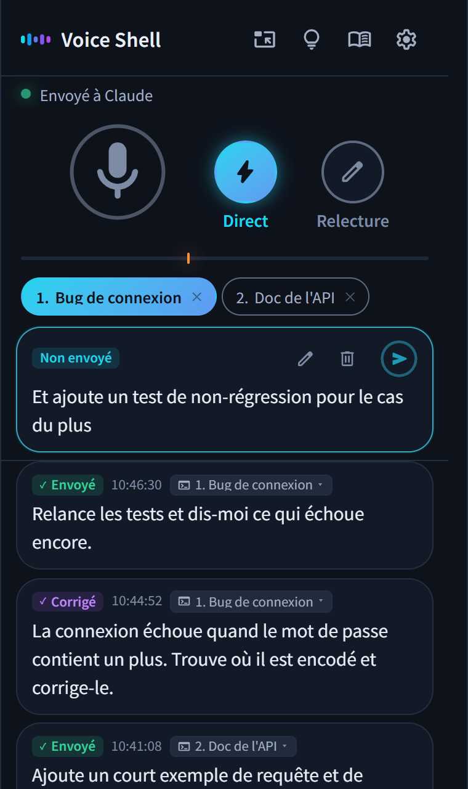

<p align="center">
  
</p>

<h1 align="center">Voice Shell</h1>

<p align="center">
  <a href="../../README.md">English</a> · <a href="README.ja.md">日本語</a> · <a href="README.es.md">Español</a> · Français · <a href="README.de.md">Deutsch</a> · <a href="README.zh.md">简体中文</a> · <a href="README.zh-TW.md">繁體中文</a> · <a href="README.ko.md">한국어</a>
</p>

<p align="center">
  
  
</p>

<h3 align="center">Dites ce que vous voulez faire, et Claude Code s'en occupe !</h3>

<p align="center">Voice Shell est une Agent Skill qui permet de donner vos instructions à Claude Code à la voix.</p>

<p align="center">
  
</p>

## 💡 Points forts

### 1. Piloter Claude Code à la voix, sans les mains

Pas besoin de bouton d'envoi. Trois secondes après la fin de votre phrase, elle part toute seule vers Claude Code.\
Couper le micro, annuler ou changer de destination, tout se fait aussi à la voix.

### 2. Un dictionnaire pour vos mots à vous

Les mots souvent mal reconnus se corrigent automatiquement, par exemple « cloud code » devient « Claude Code ».\
Noms de personnes, d'entreprises ou de services, tout s'ajoute facilement.

### 3. Entièrement gratuit, et sûr

Une reconnaissance vocale de qualité, gratuite, sans aucun abonnement.\
Sur un portable, elle passe par la reconnaissance du navigateur. Sur un Mac ou un PC puissant, tout peut rester en local.

## 📦 Installation

### Prérequis

- Claude Code
- Python 3
- Node.js
- Google Chrome

### Installer

Collez ces commandes dans votre terminal.

```bash
pip install numpy aiohttp "sounddevice>=0.5.6"
npx skills add ykuwai/voice-shell -g -a claude-code -y
```

Tapez ensuite `/voice-shell` dans Claude Code. Il vérifie ce qui manque et se lance tout seul.

### Mettre à jour

De nouvelles fonctions arrivent souvent. Pensez à mettre à jour de temps en temps.

```bash
npx skills update voice-shell -y
```

## 🎙️ Choisir la reconnaissance vocale

Voice Shell propose trois moteurs de reconnaissance. Choisissez celui qui convient à votre machine.\
Le changement se fait dans les réglages de la fenêtre. Si une installation est nécessaire, demandez simplement à Claude Code.

### 1. Portables - la reconnaissance du navigateur

Rien à installer, ça marche tout de suite.\
C'est la reconnaissance vocale gratuite intégrée à Chrome (Web Speech API).\
Tant que Chrome a le modèle de votre langue, la reconnaissance a lieu en local. Sans lui, l'audio est envoyé aux serveurs de Google. Les réglages disent laquelle des deux se passe.

### 2. Mac - la reconnaissance locale d'Apple

Si vous ne voulez pas que votre voix quitte votre ordinateur, utilisez une reconnaissance qui tourne en local.\
Sur Mac (macOS 26 ou plus récent), celle d'Apple est rapide et consomme peu d'énergie.\
Le premier lancement télécharge un modèle de reconnaissance, ce qui prend un peu de temps.

### 3. PC puissants (Windows / Linux) - Faster Whisper

Avec un GPU NVIDIA sous Windows ou Linux, [Faster Whisper](https://github.com/SYSTRAN/faster-whisper) fait tout en local.\
Le premier lancement prépare l'environnement et télécharge un modèle, ce qui prend un peu de temps.

## 🚀 Utilisation

Lancez `/voice-shell` dans Claude Code et le mode vocal démarre.\
Dites simplement ce qui vous passe par la tête, et le travail avance.\
Vos réglages sont enregistrés, et la fois suivante vous retrouvez tout comme vous l'avez laissé.

### 1. Tapez `/voice-shell` dans Claude Code

La fenêtre de Voice Shell s'ouvre dans Chrome.\
Cliquez sur « Garder cette fenêtre au-dessus » pour qu'elle reste toujours au premier plan.

### 2. Réactivez le micro et parlez

Ce que vous dites est envoyé tel quel à Claude Code.\
Les phrases très courtes (environ trois mots ou moins, comme « oui » ou « d'accord ») sont considérées comme du bruit et ne partent pas. La longueur minimale se change dans les réglages.\
Pour arrêter de parler, dites « couper le micro » et le micro s'éteint.

### 3. Pour ne pas envoyer, finissez par « annule ça »

Terminez votre phrase par « annule ça », et ce que vous venez de dire est annulé au lieu d'être envoyé.\
Pour corriger un peu avant l'envoi, cliquez sur le texte à l'écran et modifiez-le au clavier.

### 4. Utilisable depuis plusieurs sessions

Lancez `/voice-shell` dans plusieurs sessions Claude Code, et elles s'affichent numérotées en haut de la fenêtre.\
Cliquez sur une destination, ou dites « session 2 » ou « numéro deux », pour changer de destination.

> [!NOTE]
> **Quitter le mode vocal**
>
> Dites à Claude Code « arrête le mode vocal », ou tapez `/voice-shell stop`.

## 📨 Modes d'envoi

Les boutons à côté du micro permettent de changer de mode d'envoi.

- **Direct** (par défaut) → ce que vous dites part aussitôt.
- **Relecture** → ce que vous dites s'accumule à l'écran. Retouchez-le au clavier si besoin, et envoyez-le quand vous voulez.

Pour corriger seulement ce que vous venez de dire, terminez par « je corrige ». Voice Shell passe en mode Relecture juste pour cette phrase, pour que vous puissiez la corriger avant de l'envoyer.

## 🗣️ Commandes vocales utiles

| Commande vocale | Action |
|---|---|
| « couper le micro » | Coupe le micro |
| « réactiver le micro » | Réactive le micro. La reconnaissance locale l'entend, et celle du navigateur aussi quand elle tourne sur cet appareil.<br>Avec la reconnaissance ordinaire du navigateur, cliquez sur le micro à l'écran |
| « session 2 », « numéro deux » | Change de destination quand plusieurs sessions sont ouvertes |
| « annule ça » en fin de phrase | Annule ce que vous venez de dire |
| « je corrige » en fin de phrase | Passe en mode Relecture juste pour cette phrase |
| « relecture », « direct » | Change de mode d'envoi |

> [!TIP]
> L'icône de l'ampoule à l'écran affiche toutes les commandes vocales.\
> Vous pouvez aussi y ajouter vos propres commandes, ou désactiver celles qui ne vous servent pas.

### Utiliser plusieurs ordinateurs

Si deux ordinateurs écoutent en même temps, dire « couper le micro » coupe les deux.\
Ouvrez l'icône de l'ampoule, activez « Plusieurs machines » sous la liste des commandes et donnez un nom à chacun, comme « boulot » ou « perso ». Dire « boulot couper le micro » ne coupe alors que celui-là.

## ✨ Fonctions et réglages pratiques

### 1. Régler le délai d'envoi

Par défaut, l'envoi se fait trois secondes après la fin de votre phrase. Si vous aimez prendre votre temps, passez à 5 ou 10 secondes.\
Le repère sous le micro règle le niveau sonore en dessous duquel vous êtes considéré comme ayant fini de parler. Dans un endroit bruyant, montez-le un peu.

### 2. Les propos hors sujet sont mis de côté

Vous avez oublié de couper le micro et plusieurs remarques sans rapport sont parties d'affilée ? Claude Code s'en aperçoit, passe en mode Relecture et les met de côté.\
Tout ce que vous avez dit reste affiché à l'écran, rien n'est perdu.

### 3. Changer de destination après coup

Envoyé par erreur à une autre session ? Choisissez simplement la bonne à la souris.

### 4. Ajouter au dictionnaire en faisant glisser

Quand un mot est mal reconnu, faites glisser la souris dessus pour l'ajouter au dictionnaire.\
Il sera bien reconnu la fois suivante.

## ⌨️ Raccourcis clavier

| Touche | Action |
|---|---|
| `Shift` + `M` | Active ou coupe le micro |
| `Shift` + `L` | Passe en mode Direct |
| `Shift` + `H` | Passe en mode Relecture |
| `Shift` + `E` | Passe en mode Relecture juste pour ce que vous venez de dire |
| `Shift` + `1` à `9` | Choisit la destination par son numéro |
| `Shift` + `Backspace` | Supprime ce qui n'a pas encore été envoyé |
| `Ctrl` + `Enter` (`Cmd` + `Enter` sur Mac) | Envoie le texte en cours de relecture |
| `,` | Ouvre les réglages |
| `.` | Ouvre le dictionnaire |
| `?` | Affiche tous les raccourcis et commandes vocales |

## 📖 Pour les agents IA

Ces documents sont lus par Claude Code et les autres agents IA qui font tourner Voice Shell.

- [SKILL.md](../../skills/voice-shell/SKILL.md) explique l'utilisation et le comportement
- [SETUP.md](../../skills/voice-shell/SETUP.md) couvre l'installation selon l'environnement et les solutions en cas de problème

## 📄 Licence

MIT
