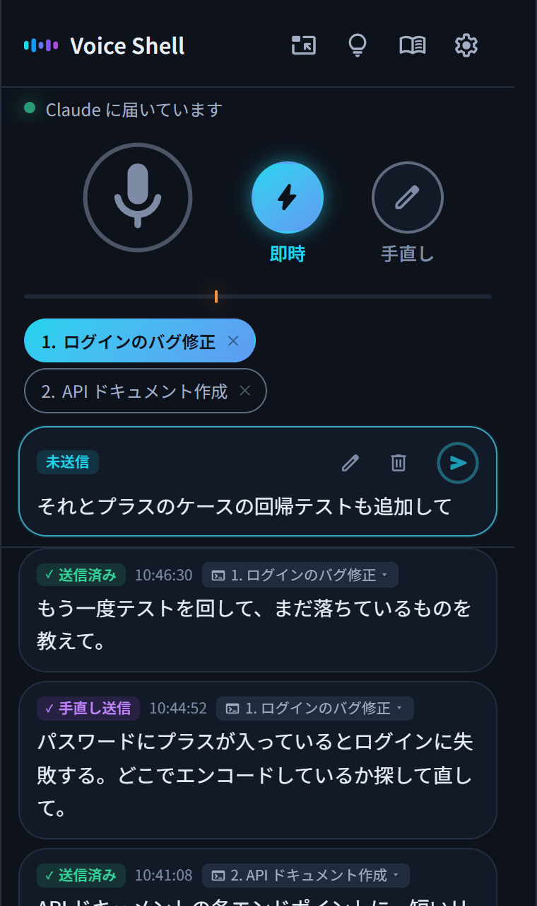

<p align="center">
  
</p>

<h1 align="center">Voice Shell</h1>

<p align="center">
  <a href="../../README.md">English</a> · 日本語 · <a href="README.es.md">Español</a> · <a href="README.fr.md">Français</a> · <a href="README.de.md">Deutsch</a> · <a href="README.zh.md">简体中文</a> · <a href="README.zh-TW.md">繁體中文</a> · <a href="README.ko.md">한국어</a>
</p>

<p align="center">
  
  
</p>

<h3 align="center">やりたいことを声に出して、Claude Code を操作しよう！</h3>

<p align="center">Voice Shell は、Claude Code に声で直接指示できる Agent Skill です。</p>

<p align="center">
  
</p>

## 💡 特長

### 1. 声だけで Claude Code を操作できる

送信ボタンは要りません。話し終えて3秒たつと、自動で Claude Code に届きます。\
ミュート、キャンセル、送信先の切り替えも、声だけでできます。

### 2. よく使う言葉を登録できる

「クラウドコード → Claude Code」のように、聞き間違えやすい言葉を自動で直せます。\
人の名前や会社名、サービス名なども、かんたんに登録できます。

### 3. 完全無料で、安全に使える

高性能な音声入力を無料で使えます。課金は一切ありません。\
ノートPCならブラウザの音声認識で、Mac や高性能なPCなら、ローカルで処理を完結させることもできます。

## 📦 セットアップ

### 必要なもの

- Claude Code
- Python 3
- Node.js
- Google Chrome

### インストール

ターミナルに次のコマンドを貼り付けて実行します。

```bash
pip install numpy aiohttp "sounddevice>=0.5.6"
npx skills add ykuwai/voice-shell -g -a claude-code -y
```

あとは Claude Code で `/voice-shell` と入力すれば、足りないものの確認から起動まで自動で進みます。

### アップデート

機能はどんどん追加しています。ときどき次のコマンドで最新にしてください。

```bash
npx skills update voice-shell -y
```

## 🎙️ 音声認識の選び方

音声認識の方式は3つあります。パソコンのスペックに合わせて選んでください。\
切り替えは画面の設定からできます。セットアップが必要なときは、Claude Code に伝えれば進めてくれます。

### 1. ノートPC ならブラウザの音声認識

セットアップ不要で、すぐに使えます。\
Chrome に入っている無料の音声認識（Web Speech API）です。\
音声は Google のサーバーで処理されます。

### 2. Mac なら Apple のローカル音声認識

音声をパソコンの外に出したくないときは、ローカルで処理する音声認識を使います。\
Mac（macOS 26 以降）なら Apple の音声認識が使えます。電力が少なくて済み、速く動きます。\
初回だけ、音声認識のモデルをダウンロードするので少し時間がかかります。

### 3. 高性能なPC（Windows / Linux）なら Faster Whisper

Windows や Linux で NVIDIA の GPU を積んでいるなら、[Faster Whisper](https://github.com/SYSTRAN/faster-whisper) でローカル処理ができます。\
初回は環境の準備とモデルのダウンロードがあるので、少し時間がかかります。

## 🚀 普段の使い方

Claude Code で `/voice-shell` を起動すれば、音声モードが始まります。\
気になることを声に出してつぶやくだけで、作業が進んでいきます。\
設定は保存されるので、2回目からは前回と同じ状態ですぐに使えます。

### 1. Claude Code で `/voice-shell` と入力して起動する

Chrome に Voice Shell の画面が開きます。\
「このウィンドウを手前に固定する」を押すと、いつも最前面に出しておけます。

### 2. ミュートを解除して話しかける

話した内容は、そのまま Claude Code に届きます。\
15文字未満の短い言葉（「うん」「はい」など）は、物音とみなして送りません。最小文字数は設定で変えられます。\
話すのをやめたいときは「ミュート」と言えば、マイクがオフになります。

### 3. 送信をやめたいときは、最後に「キャンセル」

話し終わりに「キャンセル」と言えば、今話した内容は送られずに取り消されます。\
送る前に少し直したいときは、画面の文字をクリックすれば、キーボードで直せます。

### 4. 複数のセッションから呼び出せる

複数の Claude Code で `/voice-shell` を起動すると、画面の上に番号付きで並びます。\
送信先をクリックするか、「2番」「セッション2」のように声で伝えれば、送信先を切り替えられます。

> [!NOTE]
> **音声モードの終了方法**
>
> 終わるときは、Claude Code に「音声モードを終わって」と伝えるか、`/voice-shell stop` と入力します。

## 📨 送信モード

マイクボタンの隣にあるボタンで、送信モードを切り替えられます。

- **即時**（ふだんはこちら） → 話した内容がそのまま届きます。
- **手直し** → 話した内容は画面に蓄積されます。必要に応じてキーボードで手直しして、自分のタイミングで送信できます。

今話した内容だけ直したいときは、話し終わりに「手直し」と言います。一時的に手直しモードになり、直してから送信できます。

## 🗣️ 便利な音声コマンド

| 音声コマンド | 動作 |
|---|---|
| 「ミュート」 | マイクをオフにします |
| 「ミュート解除」 | マイクをオンにします（ローカル音声認識のみ）。<br>ブラウザの音声認識では、画面のマイクを押してオンにします |
| 「2番」「セッション2」 | 複数のセッションを使っているときに送信先の番号を伝えると、送信先を切り替えられます |
| 話し終わりに「キャンセル」 | 今話した内容を取り消します |
| 話し終わりに「手直し」「エディット」 | 一時的に手直しモードになります |
| 「手直し」「即時」 | 送信モードを切り替えます |

> [!TIP]
> すべての音声コマンドは、画面の電球アイコンから確認できます。\
> 自分で音声コマンドを追加したり、使わないものをオフにしたりもできます。

### 複数台モード

2台のパソコンで同時に使っていると、「ミュート」と言っただけで両方がミュートされてしまいます。\
設定の「複数台で使う」で、それぞれに「仕事用」「趣味」のような呼び名を付けておくと、「仕事用ミュート」と言ったほうだけがミュートされます。

## ✨ 便利な機能や設定

### 1. 送信のタイミングを調整できる

最初は、話し終わってから3秒で送られます。間を空けてゆっくり話したいときは、5秒や10秒にも変更できます。\
話し終わったとみなす音量は、マイクの下のつまみで調整できます。周りの雑音が多いときは、少し高めにしてください。

### 2. 関係ない話は、自動で保留にしてくれる

ミュートし忘れて、Claude Code に関係ない話が何回か続けて届いたときは、Claude Code が自動で手直しモードに切り替えて保留にしてくれます。\
話した内容は画面に残っているので、消えてしまうことはありません。

### 3. 送信先を後から変えられる

複数のセッションで使っていて、誤って別のセッションに送信してしまったときは、送信先をマウスで選び直せます。

### 4. 辞書登録は、ドラッグでできる

聞き間違いがあったら、その部分をドラッグするだけで辞書に追加できます。\
次からは正しく認識されるので便利です。

## ⌨️ キーボードショートカット

| キー | 動作 |
|---|---|
| `Shift` + `M` | マイクのオンとオフを切り替えます |
| `Shift` + `L` | 即時モードに切り替えます |
| `Shift` + `H` | 手直しモードに切り替えます |
| `Shift` + `E` | 今話した内容だけ一時的に手直しモードにします |
| `Shift` + `1`〜`9` | 送信先を番号で切り替えます |
| `Shift` + `Backspace` | 未送信の内容を削除します |
| `Ctrl` + `Enter`（Mac は `Cmd` + `Enter`） | 手直し中の内容を送信します |
| `,` | 設定を開きます |
| `.` | 辞書を開きます |
| `?` | ショートカットと音声コマンドの一覧を開きます |

## 📖 AI エージェント向けの資料

Claude Code などの AI エージェントが、Voice Shell を動かすときに読む資料です。

- [SKILL.md](../../skills/voice-shell/SKILL.md) 　使い方と振る舞いの手順
- [SETUP.md](../../skills/voice-shell/SETUP.md) 　環境ごとの入れ方と、つまずいたときの対処

## 📄 ライセンス

MIT
