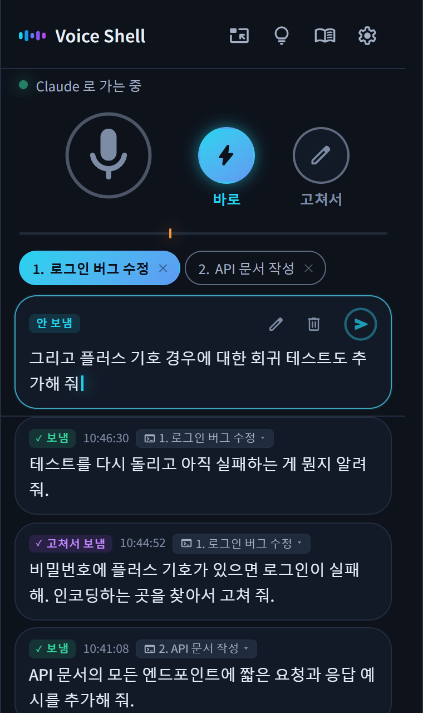

<p align="center">
  
</p>

<h1 align="center">Voice Shell</h1>

<p align="center">
  <a href="../../README.md">English</a> · <a href="README.ja.md">日本語</a> · <a href="README.es.md">Español</a> · <a href="README.fr.md">Français</a> · <a href="README.de.md">Deutsch</a> · <a href="README.zh.md">简体中文</a> · <a href="README.zh-TW.md">繁體中文</a> · 한국어
</p>

<p align="center">
  
  
</p>

<h3 align="center">하고 싶은 일을 말로 하면, Claude Code가 움직입니다!</h3>

<p align="center">Voice Shell은 Claude Code에 목소리로 바로 지시할 수 있는 Agent Skill입니다.</p>

<p align="center">
  
</p>

## 💡 특징

### 1. 목소리만으로 Claude Code를 다룰 수 있습니다

전송 버튼은 필요 없습니다. 말을 마치고 3초가 지나면 자동으로 Claude Code에 전달됩니다.\
음소거, 취소, 보낼 곳 바꾸기도 목소리만으로 할 수 있습니다.

### 2. 자주 쓰는 말을 등록할 수 있습니다

"클라우드 코드 → Claude Code"처럼 잘못 알아듣기 쉬운 말을 자동으로 고쳐 줍니다.\
사람 이름, 회사 이름, 서비스 이름도 쉽게 등록할 수 있습니다.

### 3. 완전 무료이고, 안전하게 쓸 수 있습니다

성능 좋은 음성 입력을 무료로 쓸 수 있습니다. 결제는 전혀 없습니다.\
노트북에서는 브라우저의 음성 인식을 쓰고, Mac이나 고성능 PC에서는 모든 처리를 내 컴퓨터 안에서 끝낼 수도 있습니다.

## 📦 설치

### 필요한 것

- Claude Code
- Python 3
- Node.js
- Google Chrome

### 설치하기

터미널에 다음 명령어를 붙여 넣고 실행합니다.

```bash
pip install numpy aiohttp "sounddevice>=0.5.6"
npx skills add ykuwai/voice-shell -g -a claude-code -y
```

그다음 Claude Code에서 `/voice-shell`이라고 입력하면, 빠진 것이 없는지 확인하는 것부터 실행까지 알아서 진행됩니다.

### 업데이트

기능이 계속 추가되고 있습니다. 가끔 다음 명령어로 최신 버전으로 업데이트해 주세요.

```bash
npx skills update voice-shell -y
```

## 🎙️ 음성 인식 고르기

음성 인식 방식은 세 가지입니다. 컴퓨터 사양에 맞춰 골라 주세요.\
전환은 화면의 설정에서 할 수 있습니다. 설치가 필요하면 Claude Code에 말하면 진행해 줍니다.

### 1. 노트북 - 브라우저 음성 인식

설치할 것 없이 바로 쓸 수 있습니다.\
Chrome에 들어 있는 무료 음성 인식(Web Speech API)입니다.\
Chrome 에 그 언어의 모델이 있는 동안은 로컬에서 인식됩니다. 없으면 음성은 Google 서버로 전송됩니다. 둘 중 어느 쪽인지는 설정에 나옵니다.

### 2. Mac - Apple 기기 내 음성 인식

음성을 컴퓨터 밖으로 보내고 싶지 않다면 로컬에서 처리하는 음성 인식을 씁니다.\
Mac(macOS 26 이상)에서는 Apple의 음성 인식을 쓸 수 있습니다. 전력을 적게 쓰고 빠르게 동작합니다.\
처음 한 번은 음성 인식 모델을 내려받기 때문에 조금 시간이 걸립니다.

### 3. 고성능 PC(Windows / Linux) - Faster Whisper

Windows나 Linux에서 NVIDIA GPU가 있다면 [Faster Whisper](https://github.com/SYSTRAN/faster-whisper)로 로컬 처리를 할 수 있습니다.\
처음에는 환경 준비와 모델 다운로드가 있어서 조금 시간이 걸립니다.

## 🚀 사용법

Claude Code에서 `/voice-shell`을 실행하면 음성 모드가 시작됩니다.\
떠오르는 생각을 소리 내어 말하기만 하면 작업이 진행됩니다.\
설정은 저장되므로 두 번째부터는 지난번과 같은 상태로 바로 쓸 수 있습니다.

### 1. Claude Code에서 `/voice-shell`을 입력해 시작하기

Chrome에 Voice Shell 화면이 열립니다.\
"이 창을 맨 앞에 두기"를 누르면 항상 다른 창 위에 띄워 둘 수 있습니다.

### 2. 음소거를 풀고 말하기

말한 내용은 그대로 Claude Code에 전달됩니다.\
15자 미만의 짧은 말("응", "네" 등)은 잡음으로 보고 보내지 않습니다. 최소 글자 수는 설정에서 바꿀 수 있습니다.\
그만 말하고 싶을 때는 "음소거"라고 하면 마이크가 꺼집니다.

### 3. 보내지 않으려면 끝에 "이건 취소"

말을 마칠 때 "이건 취소"라고 하면, 방금 말한 내용은 보내지 않고 취소됩니다.\
보내기 전에 조금 고치고 싶다면 화면의 글자를 클릭해서 키보드로 고칠 수 있습니다.

### 4. 여러 세션에서 불러 쓸 수 있습니다

여러 Claude Code에서 `/voice-shell`을 실행하면 화면 위쪽에 번호가 붙어 나란히 표시됩니다.\
보낼 곳을 클릭하거나 "2번", "세션 2"처럼 말하면 보낼 곳을 바꿀 수 있습니다.

> [!NOTE]
> **음성 모드 끝내기**
>
> 끝낼 때는 Claude Code에 "음성 모드 끝내 줘"라고 말하거나 `/voice-shell stop`을 입력합니다.

## 📨 전송 모드

마이크 버튼 옆의 버튼으로 전송 모드를 바꿀 수 있습니다.

- **바로**(기본) → 말한 내용이 그대로 전달됩니다.
- **고쳐서** → 말한 내용이 화면에 쌓입니다. 필요하면 키보드로 고친 뒤 원하는 때에 보낼 수 있습니다.

방금 말한 내용만 고치고 싶다면 말을 마칠 때 "이건 고쳐서"라고 합니다. 그 한 번만 고쳐서 모드가 되어, 고친 다음 보낼 수 있습니다.

## 🗣️ 편리한 음성 명령

| 음성 명령 | 동작 |
|---|---|
| "음소거" | 마이크를 끕니다 |
| "음소거 해제" | 마이크를 켭니다. 로컬 음성 인식과, 이 기기 안에서 돌아가는 브라우저 음성 인식이 듣습니다.<br>일반 브라우저 음성 인식에서는 화면의 마이크를 눌러 켭니다 |
| "2번", "세션 2" | 여러 세션을 쓸 때 번호를 말하면 보낼 곳을 바꿀 수 있습니다 |
| 말끝에 "이건 취소" | 방금 말한 내용을 취소합니다 |
| 말끝에 "이건 고쳐서" | 그 한 번만 고쳐서 모드가 됩니다 |
| "고쳐서 보내기", "바로 전달" | 전송 모드를 바꿉니다 |

> [!TIP]
> 모든 음성 명령은 화면의 전구 아이콘에서 확인할 수 있습니다.\
> 직접 음성 명령을 추가하거나, 쓰지 않는 것을 끌 수도 있습니다.

### 여러 대에서 쓰기

컴퓨터 두 대에서 동시에 쓰고 있으면 "음소거"라고만 해도 두 대 모두 음소거됩니다.\
전구 아이콘을 열고 명령 목록 아래의 "여러 대에서 쓰기"를 켠 다음 각 컴퓨터에 "회사", "집" 같은 이름을 붙여 두면, "회사 음소거"라고 말한 쪽만 음소거됩니다.

## ✨ 편리한 기능과 설정

### 1. 보내는 타이밍을 조절할 수 있습니다

기본값은 말을 마치고 3초 뒤에 보내는 것입니다. 쉬어 가며 천천히 말하고 싶다면 5초나 10초로 바꿀 수 있습니다.\
말이 끝났다고 판단하는 음량은 마이크 아래의 표시로 조절합니다. 주변 소음이 많을 때는 조금 높여 주세요.

### 2. 관계없는 말은 자동으로 보류됩니다

음소거를 깜빡해서 Claude Code와 상관없는 말이 몇 번 이어서 전달되면, Claude Code가 자동으로 고쳐서 모드로 바꿔 보류해 줍니다.\
말한 내용은 화면에 남아 있으니 사라지지 않습니다.

### 3. 보낼 곳을 나중에 바꿀 수 있습니다

여러 세션에서 쓰다가 실수로 다른 세션에 보냈다면, 마우스로 보낼 곳을 다시 고를 수 있습니다.

### 4. 드래그로 사전에 등록할 수 있습니다

잘못 알아들은 부분이 있으면 그 부분을 드래그하기만 해도 사전에 추가됩니다.\
다음부터는 제대로 인식되어 편리합니다.

## ⌨️ 키보드 단축키

| 키 | 동작 |
|---|---|
| `Shift` + `M` | 마이크를 켜고 끕니다 |
| `Shift` + `L` | 바로 모드로 바꿉니다 |
| `Shift` + `H` | 고쳐서 모드로 바꿉니다 |
| `Shift` + `E` | 방금 말한 내용만 잠시 고쳐서 모드로 둡니다 |
| `Shift` + `1`~`9` | 보낼 곳을 번호로 바꿉니다 |
| `Shift` + `Backspace` | 아직 보내지 않은 내용을 지웁니다 |
| `Ctrl` + `Enter`(Mac은 `Cmd` + `Enter`) | 고치고 있는 내용을 보냅니다 |
| `,` | 설정을 엽니다 |
| `.` | 사전을 엽니다 |
| `?` | 단축키와 음성 명령 목록을 엽니다 |

## 📖 AI 에이전트용 문서

Claude Code 같은 AI 에이전트가 Voice Shell을 실행할 때 읽는 문서입니다.

- [SKILL.md](../../skills/voice-shell/SKILL.md) 사용법과 동작 절차
- [SETUP.md](../../skills/voice-shell/SETUP.md) 환경별 설치 방법과 문제 해결

## 📄 라이선스

MIT
