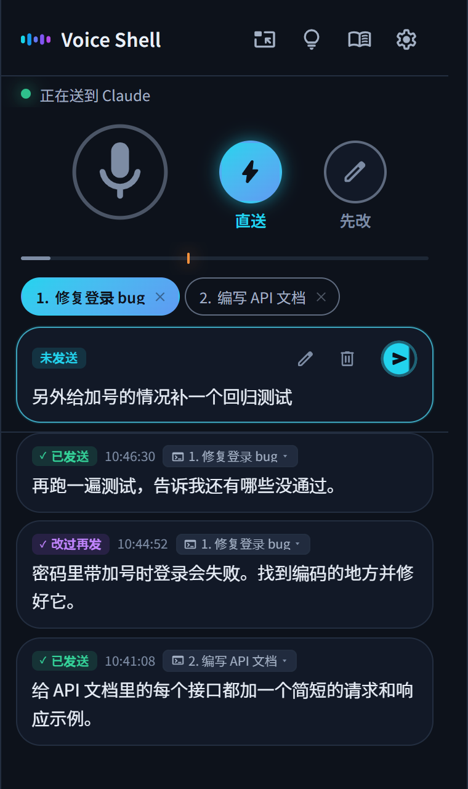

<p align="center">
  
</p>

<h1 align="center">Voice Shell</h1>

<p align="center">
  <a href="../../README.md">English</a> · <a href="README.ja.md">日本語</a> · <a href="README.es.md">Español</a> · <a href="README.fr.md">Français</a> · <a href="README.de.md">Deutsch</a> · 简体中文 · <a href="README.zh-TW.md">繁體中文</a> · <a href="README.ko.md">한국어</a>
</p>

<p align="center">
  
  
</p>

<h3 align="center">想做什么，说出来就行，Claude Code 马上开工！</h3>

<p align="center">Voice Shell 是一个 Agent Skill，让你直接用语音给 Claude Code 下指令。</p>

<p align="center">
  
</p>

## 💡 特点

### 1. 只靠说话就能操作 Claude Code

不用点发送按钮。说完 3 秒后，内容会自动发给 Claude Code。\
静音、取消、切换发送目标，也都可以用语音完成。

### 2. 常用词可以加进词典

像「cloud code → Claude Code」这样容易听错的词，可以自动改正。\
人名、公司名、服务名等，也都能轻松添加。

### 3. 完全免费，用得放心

高质量的语音输入免费使用，没有任何收费。\
笔记本电脑可以用浏览器的语音识别，Mac 或性能较强的电脑还可以完全在本地处理。

## 📦 安装

### 需要准备

- Claude Code
- Python 3
- Node.js
- Google Chrome

### 安装步骤

把下面的命令粘贴到终端里运行。

```bash
pip install numpy aiohttp "sounddevice>=0.5.6"
npx skills add ykuwai/voice-shell -g -a claude-code -y
```

然后在 Claude Code 里输入 `/voice-shell`，从检查缺少的东西到启动，都会自动完成。

### 更新

新功能会不断加入，建议时常用下面的命令更新到最新版本。

```bash
npx skills update voice-shell -y
```

## 🎙️ 选择语音识别方式

语音识别有三种方式，请根据电脑的配置来选。\
可以在窗口的设置里切换。需要安装配置时，告诉 Claude Code 就会帮你完成。

### 1. 笔记本电脑 - 浏览器语音识别

无需任何配置，马上就能用。\
使用的是 Chrome 自带的免费语音识别（Web Speech API）。\
语音会在 Google 的服务器上处理。

### 2. Mac - Apple 本地语音识别

如果不想让语音离开自己的电脑，可以使用在本地处理的语音识别。\
Mac（macOS 26 及以上）可以使用 Apple 的语音识别，耗电少，速度也快。\
第一次使用时需要下载语音识别模型，会花一点时间。

### 3. 高性能电脑（Windows / Linux）- Faster Whisper

在装有 NVIDIA 显卡的 Windows 或 Linux 上，可以用 [Faster Whisper](https://github.com/SYSTRAN/faster-whisper) 在本地处理。\
第一次使用时需要准备环境和下载模型，会花一点时间。

## 🚀 日常使用

在 Claude Code 里运行 `/voice-shell`，语音模式就会开始。\
想到什么就说出来，工作就会一步步推进。\
设置会被保存，下次启动时直接沿用上次的状态。

### 1. 在 Claude Code 里输入 `/voice-shell` 启动

Chrome 中会打开 Voice Shell 的窗口。\
点击「让这个窗口停在最前面」，窗口就会一直显示在最上层。

### 2. 解除静音，开始说话

你说的内容会直接发给 Claude Code。\
少于 15 个字的短句（比如「嗯」「好的」）会被当作杂音，不会发送。最少字数可以在设置里修改。\
想停下来时说「静音」，麦克风就会关闭。

### 3. 不想发送时，最后说「取消这句」

在一句话的末尾说「取消这句」，刚才说的内容就不会发送，直接作废。\
发送前想稍微改一下的话，点击窗口里的文字，就能用键盘修改。

### 4. 可以在多个会话中使用

在多个 Claude Code 中运行 `/voice-shell`，窗口顶部会排出带编号的会话。\
点击发送目标，或者说「会话2」「第2个」，就能切换发送目标。

> [!NOTE]
> **如何结束语音模式**
>
> 结束时，对 Claude Code 说「结束语音模式」，或者输入 `/voice-shell stop`。

## 📨 发送方式

用麦克风按钮旁边的按钮，可以切换发送方式。

- **直送**（默认） → 说的内容会直接发出去。
- **先改** → 说的内容先攒在窗口里。需要时用键盘修改，在你想发的时候再发送。

只想修改刚说的这一句时，在末尾说「这句我来改」。这一句会临时切换到先改模式，改好后再发送。

## 🗣️ 实用语音指令

| 语音指令 | 作用 |
|---|---|
| 「静音」 | 关闭麦克风 |
| 「解除静音」 | 打开麦克风。本地语音识别，以及在本机识别的浏览器语音识别，都能听到。<br>使用普通的浏览器语音识别时，请点击窗口里的麦克风打开 |
| 「会话2」「第2个」 | 同时使用多个会话时，说出编号即可切换发送目标 |
| 末尾说「取消这句」 | 取消刚才说的内容 |
| 末尾说「这句我来改」「先留着改」 | 临时切换到先改模式 |
| 「改完再发」「直接发送」 | 切换发送方式 |

> [!TIP]
> 所有语音指令都可以通过窗口里的灯泡图标查看。\
> 你也可以添加自己的说法，或者关掉用不到的指令。

### 多台机器模式

如果两台电脑同时在用，只说「静音」会让两台都静音。\
打开灯泡图标，在指令列表下方打开「多台机器一起用」，给每台电脑起一个名字，比如「公司」「家里」，这样说「公司静音」时，只有那一台会静音。

## ✨ 实用功能与设置

### 1. 可以调整发送时机

默认是说完 3 秒后发送。想慢慢说、中间多停顿一会儿的话，也可以改成 5 秒或 10 秒。\
判断说完的音量，可以用麦克风下方的标记来调整。周围噪音较大时，请调高一点。

### 2. 无关的话会自动先存着

忘了静音，几句和 Claude Code 无关的话接连发了过去时，Claude Code 会自动切换到先改模式，把它们先存起来。\
说过的内容还留在窗口里，不会丢失。

### 3. 发送目标可以事后更改

同时使用多个会话时，如果不小心发到了别的会话，可以用鼠标重新选择发送目标。

### 4. 拖动就能加入词典

遇到听错的地方，只要拖动选中那部分，就能加入词典。\
下次就能正确识别，非常方便。

## ⌨️ 键盘快捷键

| 按键 | 作用 |
|---|---|
| `Shift` + `M` | 打开或关闭麦克风 |
| `Shift` + `L` | 切换到直送模式 |
| `Shift` + `H` | 切换到先改模式 |
| `Shift` + `E` | 只让刚说的这一句临时进入先改模式 |
| `Shift` + `1` 到 `9` | 按编号切换发送目标 |
| `Shift` + `Backspace` | 删除还没发送的内容 |
| `Ctrl` + `Enter`（Mac 上是 `Cmd` + `Enter`） | 发送正在修改的内容 |
| `,` | 打开设置 |
| `.` | 打开词典 |
| `?` | 打开快捷键和语音指令列表 |

## 📖 给 AI 智能体的文档

这些是 Claude Code 等 AI 智能体运行 Voice Shell 时阅读的文档。

- [SKILL.md](../../skills/voice-shell/SKILL.md) 　使用方法和行为步骤
- [SETUP.md](../../skills/voice-shell/SETUP.md) 　各环境的安装方法，以及遇到问题时的处理办法

## 📄 许可证

MIT
